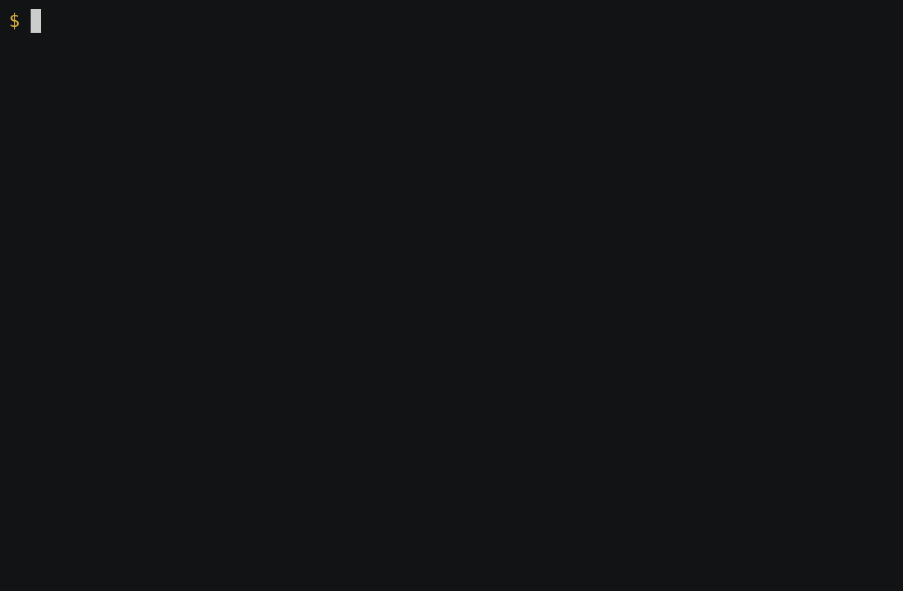

The "cast" screenshots were made with asciienema and then running through `asciicast2gif`.

For example:

```
$ asciinema rec trepan-xpy-demo1.cast
```

You can edit the `.cast` files. The specific commands used after this were:

```console
$ asciicast2gif -w 82 -h 24 trepan-xpy-demo1.{cast,gif}
```
